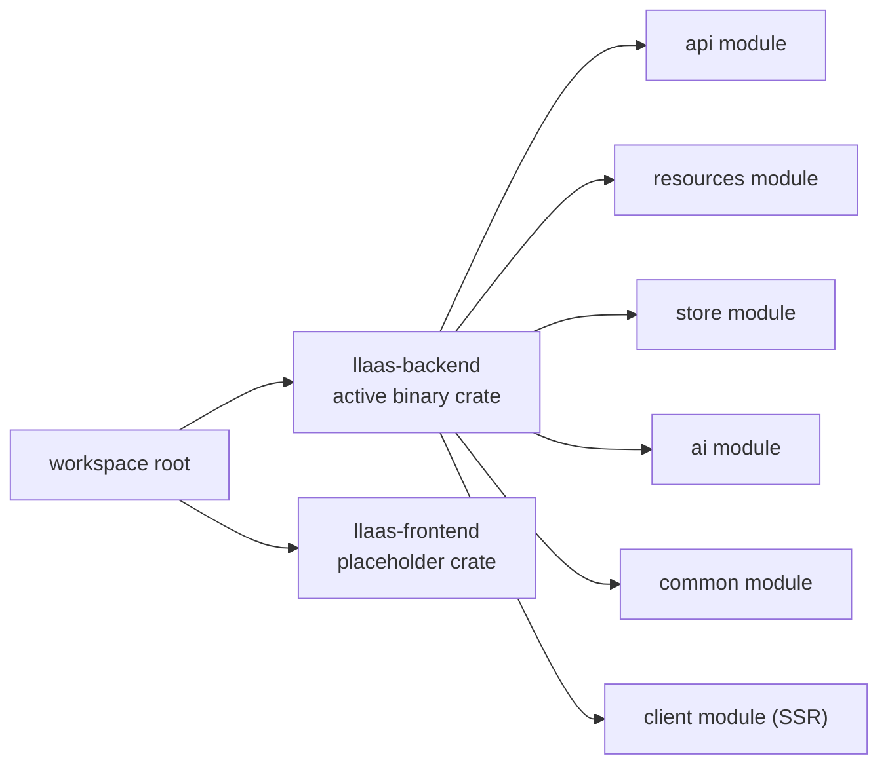
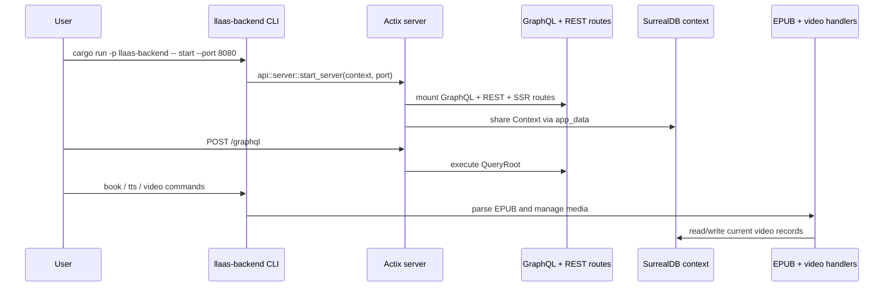

# LLAAS

LLAAS is a language learning platform server.

The long-term refactor plan is tracked in [plans/workspace-graphql-refactor.md](plans/workspace-graphql-refactor.md). This README documents the current, runnable state of the repository.

## Current Workspace

The workspace currently contains two crates:

- `llaas-backend`: active binary crate (CLI + Actix server + SSR shell + internal modules).
- `llaas-frontend`: placeholder library crate for future standalone frontend work.

```sh
cargo check --workspace
cargo run -p llaas-backend -- --help
```

## Workspace Map



## Runtime Flow



## Commands

### Workspace Checks

| Command | What it does |
| --- | --- |
| `cargo check --workspace` | Type-checks all workspace crates. |
| `cargo run -p llaas-backend -- --help` | Shows available CLI commands in the active backend binary. |
| `cargo run -p llaas-backend -- info` | Prints a basic backend status line. |

### CLI Examples

| Command | What it does |
| --- | --- |
| `cargo run -p llaas-backend -- book --from resources/danish/book1.epub --to /tmp/book.json` | Parses an EPUB and writes JSON output. |
| `cargo run -p llaas-backend -- tts --text "hello" --file /tmp/hello.wav --lang en` | Generates speech audio and writes a WAV file. |
| `cargo run -p llaas-backend -- video --url <video-url> --languages en es` | Downloads video/subtitles with `yt-dlp` and updates the video store. |
| `cargo run -p llaas-backend -- start --port 8080` | Starts the Actix server with GraphQL, REST, media, and SSR routes. |

## Server URLs

Start the server first:

```sh
cargo run -p llaas-backend -- start --port 8080
```

Then use these URLs:

| URL | Method | What it does |
| --- | --- | --- |
| `http://127.0.0.1:8080/` | `GET` | Current SSR home shell (`client` module). |
| `http://127.0.0.1:8080/videos/{video_id}/{language}` | `GET` | Current SSR video page route. |
| `http://127.0.0.1:8080/graphql` | `POST` | GraphQL endpoint (`serviceName`, `languages`). |
| `http://127.0.0.1:8080/graphql/ws` | `GET` websocket | GraphQL subscription endpoint mount. |
| `http://127.0.0.1:8080/admin/graphql` | `GET` | GraphiQL explorer for `/graphql`. |
| `http://127.0.0.1:8080/languages/list` | `GET` | REST language list stub. |
| `http://127.0.0.1:8080/languages/add` | `POST` | Validates JSON body `{ "name": "..." }`. |
| `http://127.0.0.1:8080/languages/update/{code}` | `PATCH` | Validates language code path param. |
| `http://127.0.0.1:8080/videos/{id}.mp4` | `GET` | Streams downloaded MP4 with range support. |
| `http://127.0.0.1:8080/videos/{id}/{lang}/subtitles.vtt` | `GET` | Serves downloaded VTT subtitles. |

Example GraphQL request:

```sh
curl -s http://127.0.0.1:8080/graphql \
  -H 'content-type: application/json' \
  --data '{"query":"{ serviceName languages }"}'
```

## Module Overview

### `llaas-backend`

The active crate groups functionality by internal modules under `crates/llaas-backend/src`.

| Module | Role |
| --- | --- |
| `main.rs` | CLI entrypoint (`info`, `book`, `tts`, `video`, `start`) and context initialization. |
| `api/server.rs` | Actix server bootstrap and route wiring. |
| `api/graphql.rs` | GraphQL schema and handlers (`/graphql`, `/graphql/ws`, `/admin/graphql`). |
| `api/rest.rs` | REST language endpoints and media routes. |
| `client/*` | SSR Leptos shell, router, and pages. |
| `resources/*` | EPUB/video parsing, download, and media serving helpers. |
| `store/*` | SurrealDB context/database access and video persistence. |
| `ai/*` | Keyword extraction, TTS, translation/classification demos. |
| `common/*` | Shared config, context, and error types. |

### `llaas-frontend`

Placeholder crate for future frontend/admin extraction:

| Module | Role |
| --- | --- |
| `src/lib.rs` | Placeholder docs and future ownership notes. |

## Environment And External Tools

- `DATABASE_PATH` defaults to `./resources/db`.
- `DATABASE_USERNAME` defaults to `root`.
- `DATABASE_PASSWORD` defaults to `root`.
- `yt-dlp` must be available on `PATH` for the `video` command.
- TTS and rust-bert model operations may require large model/runtime assets.
