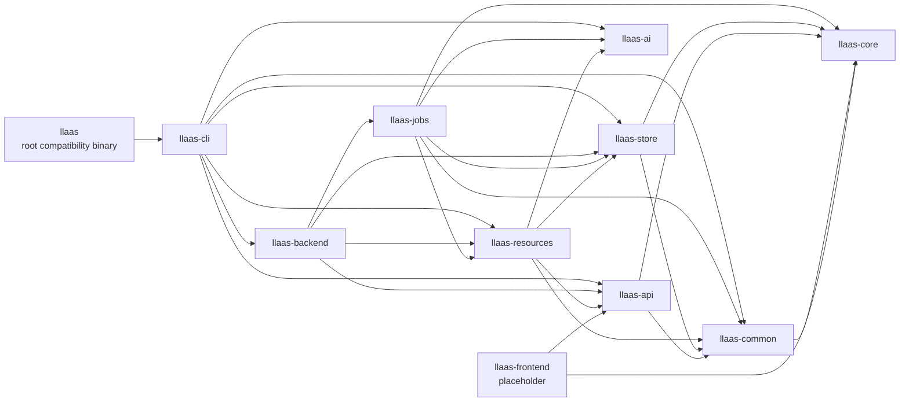
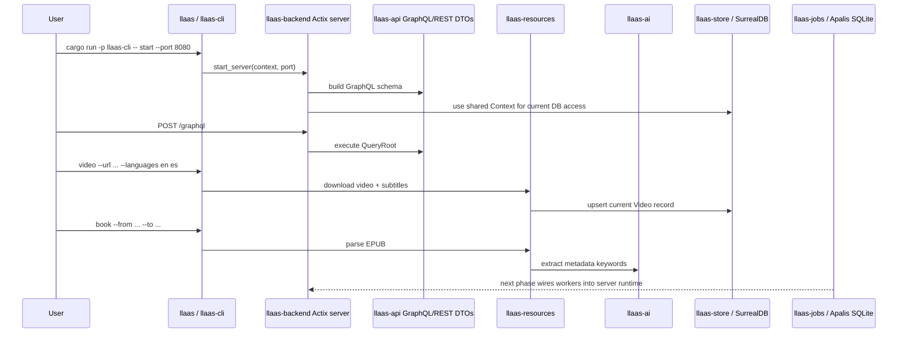
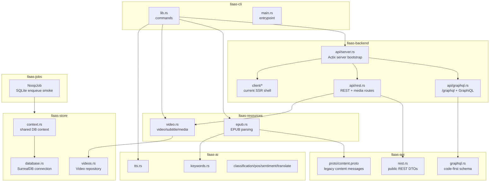

# LLAAS

LLAAS is a language learning platform server. The repository is being split into workspace crates while preserving the existing command behavior.

The refactor plan lives in [plans/workspace-graphql-refactor.md](plans/workspace-graphql-refactor.md).

## Current Checkpoint

The root `llaas` package is a thin compatibility binary that delegates to `llaas-cli`. Most current behavior has been moved into workspace crates, while later phases will replace local CLI calls with GraphQL service calls and a dedicated frontend/admin UI.

```sh
cargo check --workspace
cargo build
```

## Workspace Map



## Runtime Flow



## Commands And URLs

### Workspace Checks

| Command | What it does | URLs |
| --- | --- | --- |
| `cargo check --workspace` | Type-checks every workspace crate. Use this after structural changes. | None |
| `cargo build` | Builds the root compatibility binary `llaas`, which delegates to `llaas-cli`. | None |
| `cargo test -p llaas-api` | Runs API/schema tests, including SDL export checks. | None |
| `cargo test -p llaas-jobs sqlite_storage_accepts_noop_job` | Verifies the pinned Apalis SQLite stack can enqueue a no-op job into in-memory SQLite. | None |

### CLI Entry Points

Both commands expose the same current subcommands. Prefer `llaas-cli` for new work; the root `llaas` binary remains as compatibility glue.

```sh
cargo run -p llaas -- --help
cargo run -p llaas-cli -- --help
```

| Command | What it does | URLs |
| --- | --- | --- |
| `cargo run -p llaas-cli -- --help` | Shows the CLI command surface. | None |
| `cargo run -p llaas -- --help` | Shows the same command surface through the root compatibility binary. | None |
| `cargo run -p llaas-cli -- book --from resources/danish/book1.epub --to /tmp/book.json` | Parses an EPUB, extracts metadata/chapters, runs keyword extraction, and writes JSON. | None |
| `cargo run -p llaas-cli -- tts --text "hello" --file /tmp/hello.wav --lang en` | Runs the current TTS model path and writes WAV audio. This may require model/runtime setup. | None |
| `cargo run -p llaas-cli -- video --url <video-url> --languages en es` | Runs `yt-dlp`, stores media under `resources/videos/{id}/`, extracts subtitles, and upserts the current video record through `llaas-store`. | Media is available after starting the server: `/videos/{id}.mp4`, `/videos/{id}/{lang}/subtitles.vtt` |
| `cargo run -p llaas-cli -- start --port 8080` | Starts the Actix server from `llaas-backend`, including REST/media routes, GraphQL routes, GraphiQL, and the current SSR Leptos shell. | See server URLs below |
| `cargo run -p llaas -- start --port 8080` | Same as above through the root compatibility binary. | See server URLs below |

### Server URLs

Start the server first:

```sh
cargo run -p llaas-cli -- start --port 8080
```

Then use these URLs:

| URL | Method | What it does |
| --- | --- | --- |
| `http://127.0.0.1:8080/` | `GET` | Current SSR Leptos home shell from `llaas-backend::client`. |
| `http://127.0.0.1:8080/videos/{video_id}/{language}` | `GET` | Current SSR video page route. |
| `http://127.0.0.1:8080/graphql` | `POST` | GraphQL endpoint. Current schema exposes `serverInfo` and `languages`. |
| `http://127.0.0.1:8080/graphql/ws` | `GET` websocket | GraphQL subscription endpoint. It is mounted now; useful subscriptions will be added as job/resource events are implemented. |
| `http://127.0.0.1:8080/admin/graphql` | `GET` | GraphiQL v2 explorer connected to `/graphql` and `/graphql/ws`. |
| `http://127.0.0.1:8080/languages/list` | `GET` | Current REST language stub. |
| `http://127.0.0.1:8080/languages/add` | `POST` | Validates and accepts a `LanguageRequest` JSON payload. Stub behavior for now. |
| `http://127.0.0.1:8080/languages/update/{code}` | `PATCH` | Validates a language code path payload. Stub behavior for now. |
| `http://127.0.0.1:8080/videos/{id}.mp4` | `GET` | Streams a downloaded MP4 with HTTP range support. |
| `http://127.0.0.1:8080/videos/{id}/{lang}/subtitles.vtt` | `GET` | Serves a downloaded VTT subtitle file. |

Example GraphQL request:

```sh
curl -s http://127.0.0.1:8080/graphql \
  -H 'content-type: application/json' \
  --data '{"query":"{ serverInfo { name version } languages { code name } }"}'
```

## Crate Roles And Modules

### `llaas-core`

Pure domain crate. It is intentionally almost empty at the current checkpoint.

| Module/File | Role |
| --- | --- |
| `src/lib.rs` | Domain crate placeholder and dependency-boundary documentation. |

### `llaas-common`

Shared native utilities. This crate currently contains transitional config and error types used by the moved implementation.

| Module/File | Role |
| --- | --- |
| `src/config.rs` | Reads current database configuration from `DATABASE_PATH`, `DATABASE_USERNAME`, and `DATABASE_PASSWORD`. Defaults to embedded local resources. |
| `src/errors.rs` | Shared `Error` type and conversions from I/O, SurrealDB, and TTS errors. |
| `src/lib.rs` | Exports common modules. |

### `llaas-api`

Public API contract crate. It owns the current GraphQL schema, REST DTOs, and generated legacy content messages.

| Module/File | Role |
| --- | --- |
| `src/graphql.rs` | Code-first `async-graphql` schema. Current `QueryRoot` exposes `serverInfo` and `languages`; includes an SDL export test. |
| `src/rest.rs` | Public REST DTOs for language validation: `LanguageRequest`, `LanguageUrl`. |
| `src/lib.rs` | Exports `graphql`, `rest`, and generated `messages`. |
| `proto/content.proto` | Temporary protobuf content model for `Book`, `Article`, `Chapter`, `Paragraph`, and `Line`. This is kept for behavior preservation during the refactor. |
| `build.rs` | Generates the temporary protobuf content types into `OUT_DIR`. |

### `llaas-store`

Persistence crate. It currently owns the transitional embedded SurrealDB/RocksDB path; future phases will move this to remote SurrealDB only.

| Module/File | Role |
| --- | --- |
| `src/context.rs` | Shared application `Context` with lazy database connection initialization. |
| `src/database.rs` | Current embedded SurrealDB RocksDB connection and `record(table, key)` helper. |
| `src/videos.rs` | Current `Video` record type, `VideoDatabase` trait, and `Context` implementation for upsert. |
| `src/lib.rs` | Exports store modules. |

### `llaas-ai`

Heavy AI/model integration crate.

| Module/File | Role |
| --- | --- |
| `src/keywords.rs` | Wraps rust-bert keyword extraction. Used by EPUB parsing today. |
| `src/tts.rs` | Wraps `any-tts` and writes WAV output. Used by the CLI `tts` command. |
| `src/translate.rs` | Translation model demo wrapper. |
| `src/classification.rs` | Zero-shot classification demo wrapper. |
| `src/sentiment.rs` | Sentiment analysis demo wrapper. |
| `src/pos.rs` | Part-of-speech tagging demo wrapper. |
| `src/lib.rs` | Exports AI modules. |

### `llaas-resources`

Resource parsing, media handling, and current transitional HTTP media helpers.

| Module/File | Role |
| --- | --- |
| `src/epub.rs` | Parses EPUB metadata and HTML chapters into generated `Book` messages; currently calls `llaas-ai` for keyword extraction. |
| `src/video.rs` | Downloads videos/subtitles with `yt-dlp`, reads media metadata, serves VTT, and streams MP4 files with range support. HTTP serving will later move fully into `llaas-backend`. |
| `src/lib.rs` | Exports resource modules. |

### `llaas-jobs`

Job payload and worker orchestration crate. This is the first Apalis integration spike.

| Module/File | Role |
| --- | --- |
| `src/lib.rs` | Defines `NoopJob`, `handle_noop_job`, and an in-memory SQLite enqueue smoke test. |
| `Cargo.toml` | Pins the Apalis 1.0 RC dependency family together to avoid incompatible RC trait shapes. |

### `llaas-backend`

Single server/runtime crate. It owns the current Actix server and temporary SSR shell.

| Module/File | Role |
| --- | --- |
| `src/api/server.rs` | Starts Actix, initializes the Leptos executor, creates the GraphQL schema, and configures REST, GraphQL, and SSR client routes. |
| `src/api/graphql.rs` | Mounts `POST /graphql`, `GET /graphql/ws`, and `GET /admin/graphql`. |
| `src/api/rest.rs` | Current REST language stubs and video/VTT media endpoints. |
| `src/api.rs` | API module exports. |
| `src/client.rs` | Current SSR Leptos app shell and catch-all route. |
| `src/client/app.rs` | Current Leptos router. |
| `src/client/homepage.rs` | Current home page. |
| `src/client/videos.rs` | Current video route and subtitle timeline stub. |
| `src/lib.rs` | Exports backend modules. |

### `llaas-cli`

Command-line crate. It currently owns the existing behavior-preserving commands; later phases will convert these to GraphQL client calls.

| Module/File | Role |
| --- | --- |
| `src/lib.rs` | Implements `book`, `tts`, `video`, and `start` commands. |
| `src/main.rs` | Binary entry point that calls `llaas_cli::run()`. |

### `llaas-frontend`

Future Leptos CSR/hydrated server/admin UI crate. It is currently a placeholder.

| Module/File | Role |
| --- | --- |
| `src/lib.rs` | Placeholder for the future admin shell, GraphQL client interactions, media UI, GraphQL explorer integration, and Apalis board integration points. |

### Root `llaas`

Compatibility package at the workspace root.

| Module/File | Role |
| --- | --- |
| `src/main.rs` | Thin compatibility binary that delegates to `llaas_cli::run()`. |
| `Cargo.toml` | Workspace root plus compatibility package manifest. |

## Module Ownership Chart



## Environment And External Tools

- `DATABASE_PATH` defaults to `./resources/db`.
- `DATABASE_USERNAME` defaults to `root`.
- `DATABASE_PASSWORD` defaults to `root`.
- `yt-dlp` must be available on `PATH` for the `video` command.
- TTS and rust-bert model commands may download or load large local model/runtime assets.

## Refactor Notes

- `llaas-api` already has a code-first GraphQL schema, but it is intentionally minimal.
- `llaas-jobs` already validates the pinned Apalis SQLite stack with a no-op enqueue smoke test.
- `llaas-frontend` is not the active UI yet; the current UI is still the SSR shell in `llaas-backend`.
- The current store still uses embedded SurrealDB/RocksDB for behavior preservation. The plan moves this to remote SurrealDB later.
